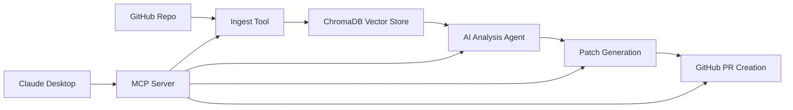

# GIS — GitHub Issue Solver

[](https://pypi.org/project/gis-cli/)
[](https://www.python.org/downloads/)
[](https://modelcontextprotocol.io/)
[]()
[](https://opensource.org/licenses/MIT)

Autonomous agent that resolves GitHub issues end-to-end: ingests a repository into a RAG knowledge base, analyzes issues, generates patches, and creates pull requests.

Available as a **pip package** (`gis-cli`), a **CLI tool** (`gis`), and an **MCP server** for Claude Desktop / Cursor.

```bash
pip install gis-cli
gis setup            # configure API keys
gis <issue-url>      # resolve an issue
```

---

## Architecture

```
                    ┌─────────────────────────────────────────────────┐
                    │                   GIS Agent                     │
                    │                                                 │
                    │   ┌──────────┐    ┌──────────┐                 │
                    │   │  ReAct   │───>│ 11 Tools │                 │
                    │   │  Loop    │<───│ (LangCh) │                 │
                    │   └──────────┘    └──────────┘                 │
                    │        │               │                        │
                    │        ▼               ▼                        │
                    │   ┌──────────┐    ┌──────────┐                 │
                    │   │ LiteLLM  │    │ ChromaDB │                 │
                    │   │ Router   │    │ VectorDB │                 │
                    │   └──────────┘    └──────────┘                 │
                    │   Gemini│Claude     Code│Docs                  │
                    │   Grok│OpenAI      Issues│PRs                  │
                    │   Ollama           Learnings                   │
                    └─────────────────────────────────────────────────┘
                         │                    │
        ┌────────────────┘                    └────────────────┐
        ▼                                                      ▼
   ┌──────────┐                                          ┌──────────┐
   │  CLI/TUI │  gis <url>                               │MCP Server│  Claude Desktop
   │  (click) │  gis setup                               │ (FastMCP)│  Cursor / VS Code
   └──────────┘  gis status                              └──────────┘  17 tools
```
### Data Flow



### Module Layout

```
cli_agent/                      # CLI package (entry point)
├── main.py                     # Click CLI: gis, gis setup, gis run
├── agent.py                    # ReAct loop: LLM → tool calls → observe → repeat
├── tools.py                    # 11 LangChain tools (bash, read/write, RAG, git)
├── display.py                  # Rich console output (--no-tui mode)
├── services.py                 # Service initialization bridge
├── prompts.py                  # Agent system prompt
├── prompts_tui.py              # Arrow-key selector (stdlib tty/termios)
├── setup.py                    # Interactive setup wizard
└── tui/                        # Textual split-pane TUI
    ├── app.py                  # GISApp (async UI)
    ├── bridge.py               # Thread-safe agent→TUI bridge
    └── widgets/                # header, activity_log, diff_viewer, modal

src/github_issue_solver/        # Core service layer
├── config.py                   # Config with env vars, provider detection
├── server.py                   # MCP server (FastMCP, 17 tools)
├── services/
│   ├── llm_service.py          # LiteLLM unified router (5 providers)
│   ├── embedding_service.py    # FastEmbed (offline) / Google embeddings
│   ├── ingestion_service.py    # 4-step repo ingestion pipeline
│   ├── analysis_service.py     # RAG-powered issue analysis
│   ├── patch_service.py        # AI patch generation
│   ├── learning_service.py     # Per-repo learnings & never-do rules
│   ├── health_service.py       # System health monitoring
│   ├── repository_service.py   # GitHub API operations
│   └── state_manager.py        # Thread-safe persistent state

issue_solver/                   # Core algorithms
├── analyze.py                  # LangChain agent for issue analysis
├── ingest.py                   # GitHub data fetching & chunking
└── patch.py                    # Patch generation logic

evals/                          # RAG evaluation framework
├── run_eval.py                 # Evaluation runner (LLM-as-judge)
└── golden_dataset.json         # Ground-truth Q&A pairs
```

---

## Quick Start

### Install

```bash
# From PyPI (recommended)
pip install gis-cli

# Or from source
git clone https://github.com/devdattatalele/GIS.git
cd GIS
pip install -e .
```

### Configure

```bash
gis setup
```

Interactive wizard with arrow-key navigation. Configures:
- LLM provider (Gemini, Claude, Grok, OpenAI, Ollama)
- API key
- GitHub token
- Embedding model (FastEmbed offline or Google)

Config is saved to `~/.config/gis/config.env`.

### Run

```bash
# Interactive menu
gis

# Resolve an issue directly
gis https://github.com/owner/repo/issues/123

# Classic output (no TUI)
gis https://github.com/owner/repo/issues/123 --no-tui

# Override provider
gis run <url> --provider grok --model grok-3
```

### MCP Server (Claude Desktop / Cursor)

Add to `claude_desktop_config.json`:

```json
{
  "mcpServers": {
    "github-issue-solver": {
      "command": "python3",
      "args": ["/path/to/project/main.py"],
      "env": {
        "PYTHONPATH": "/path/to/project/src:/path/to/project"
      }
    }
  }
}
```

---

## LLM Providers

Unified routing via [LiteLLM](https://github.com/BerriAI/litellm). One config switch, all providers work identically with LangChain tool calling.

| Provider | Model (default) | Env Variable | Notes |
|----------|----------------|--------------|-------|
| `gemini` | `gemini-2.5-flash` | `GOOGLE_API_KEY` | Free tier available |
| `claude` | `claude-sonnet-4-5-20241022` | `ANTHROPIC_API_KEY` | Strong code quality |
| `grok` | `grok-3-mini` | `XAI_API_KEY` | Strong reasoning |
| `openai` | `gpt-4o-mini` | `OPENAI_API_KEY` | Widely supported |
| `ollama` | `llama3.1` | None (local) | Offline, no API cost |

Override model: `gis run <url> --provider gemini --model gemini-2.5-pro`

---

## RAG Pipeline

### Ingestion (4 steps)

Each repository is ingested into isolated ChromaDB collections:

```
Step 1: Documentation  → README, wikis, guides
Step 2: Source Code     → parsed, chunked by language
Step 3: Issues History  → up to MAX_ISSUES (default 100)
Step 4: PR History      → up to MAX_PRS (default 15)
```

**Chunking strategy** is provider-aware:
- FastEmbed (offline): 8-10KB chunks, batch size 100
- Google embeddings: 4-6KB chunks, batch size 10

### Retrieval

Semantic search over ChromaDB using the configured embedding model. The agent has access to:
- `search_codebase` — search ingested code
- `search_learnings` — search accumulated patterns and rules
- `analyze_issue` — full RAG analysis with root cause, affected files, proposed solution

### Embedding Models

| Provider | Model | Speed | Cost | Quality |
|----------|-------|-------|------|---------|
| `fastembed` | BAAI/bge-small-en-v1.5 | ~3-4s/batch | Free | Good |
| `google` | embedding-004 | ~45-60s/batch | API quota | Higher |

---

## RAG Evaluation

Built-in evaluation framework measures retrieval quality using LLM-as-judge scoring.

### Run Evals

```bash
# Full evaluation against ingested repos
gis eval

# Filter to a specific repo
gis eval --repo windmill-labs/windmill

# Compare embedding providers
gis eval --embedding fastembed --output evals/report_fastembed.json
gis eval --embedding google --output evals/report_google.json

# Generate PDF report from results
gis eval-report
```

### Metrics

| Metric | What it measures |
|--------|-----------------|
| **Context Precision** | Are retrieved chunks relevant to the query? |
| **Context Recall** | Did we find all chunks needed to answer? |
| **Faithfulness** | Does the answer stick to context (no hallucination)? |
| **Answer Relevancy** | Does the answer address the question? |

### Output

```
  GIS RAG Evaluation
  ========================================
  LLM:        gemini / gemini-2.5-flash
  Embeddings: fastembed (BAAI/bge-small-en-v1.5)
  Questions:  10

  [1/10] How does Windmill handle job timeouts...
    -> precision=0.90  recall=0.90  faithful=1.00  relevancy=0.80  avg=0.90
  [3/10] What scripting languages does Windmill support...
    -> precision=1.00  recall=1.00  faithful=1.00  relevancy=1.00  avg=1.00
  ...

  ========================================
  RESULTS (10 questions scored)

  Context Precision:  0.78
  Context Recall:     0.80
  Faithfulness:       0.99
  Answer Relevancy:   0.69
  ────────────────────────────
  Overall Score:      0.81
  Avg Retrieval:      0.326s
```

Reports saved to `evals/report.json` with full per-question breakdowns.

---

## Learning System

The agent accumulates per-repository knowledge across runs:

- **Never-do rules** — patterns that should never appear in PRs
- **Code patterns** — do/don't examples with language tags
- **Checklists** — pre-PR verification items
- **PR takeaways** — lessons from past PR outcomes

Learnings are stored as JSON + embedded in ChromaDB for semantic search. The `get_pre_pr_checklist` tool queries accumulated wisdom before creating PRs.

```bash
# MCP tools
search_similar_learnings("owner/repo", "error handling")
get_pre_pr_checklist("owner/repo", files_changed=["src/auth.py"])
add_pr_learning("owner/repo", "never_do", {"rule": "...", "reason": "..."})
```

---

## Agent Tools

The ReAct agent has 11 tools:

| Tool | Purpose |
|------|---------|
| `bash` | Shell commands (git, tests, gh CLI) |
| `read_file` | Read file contents |
| `write_file` | Create/overwrite files |
| `edit_file` | Search-and-replace in files |
| `analyze_issue` | RAG-powered issue analysis |
| `generate_patches` | AI-suggested code patches |
| `search_codebase` | Semantic search over code |
| `search_learnings` | Search accumulated learnings |
| `ingest_repo` | Ingest repo into vector DB |
| `get_repo_status` | Check ingestion status |
| `show_diff` | Show git diff of changes |

The MCP server exposes 17 tools (the 11 above + management, health, learning tools).

---

## Configuration

All config via environment variables or `~/.config/gis/config.env`:

```env
# LLM (choose one provider)
LLM_PROVIDER=gemini              # gemini, claude, grok, openai, ollama
GOOGLE_API_KEY=...               # for gemini
ANTHROPIC_API_KEY=...            # for claude
XAI_API_KEY=...                  # for grok
OPENAI_API_KEY=...               # for openai

# GitHub
GITHUB_TOKEN=...                 # repo, read:org scopes

# Embeddings
EMBEDDING_PROVIDER=fastembed     # fastembed (offline) or google
EMBEDDING_MODEL_NAME=BAAI/bge-small-en-v1.5

# Ingestion limits
MAX_ISSUES=100
MAX_PRS=15                       # keep low for large repos
MAX_FILES=50

# Storage
CHROMA_PERSIST_DIR=./chroma_db
```

---

## Threading Model

Three concurrency models bridged together:

```
Textual TUI (async)  ←──bridge──→  Agent Loop (sync)  ←──_run_async──→  Services (async)
     │                                    │                                    │
     │  call_from_thread()               │  blocking LLM calls               │  asyncio.to_thread()
     │  (widget updates)                 │  tool execution                   │  (GitHub API, ChromaDB)
     │                                    │                                    │
  async event loop              @work(thread=True)                    new event loop per call
```

- **TUI**: Textual async app with reactive widgets
- **Agent**: Sync ReAct loop driving LLM + tools in a background thread
- **Services**: Async service methods called via `_run_async()` bridge

The `DisplayBridge` implements the same API as `Display` (Rich), making agent code display-agnostic.

---

## Development

```bash
# Install from source
git clone https://github.com/devdattatalele/GIS.git
cd GIS
pip install -e .

# Run directly
python -m cli_agent.main

# Run MCP server
python main.py

# Run RAG evals
gis eval

# Generate PDF eval report
gis eval-report

# Check config
gis status
```

### Version History

| Version | Key Changes |
|---------|------------|
| v4.0 | LiteLLM multi-provider (5 providers), RAG eval framework, CLI package |
| v3.0 | FastEmbed offline embeddings, timeout prevention, learning system |
| v2.0 | Service architecture, health monitoring, custom exceptions |
| v1.0 | Monolithic MCP server, single Gemini provider |

---

## License

MIT License. See [LICENSE](LICENSE).

Built by [Devdatta Talele](https://github.com/devdattatalele).
